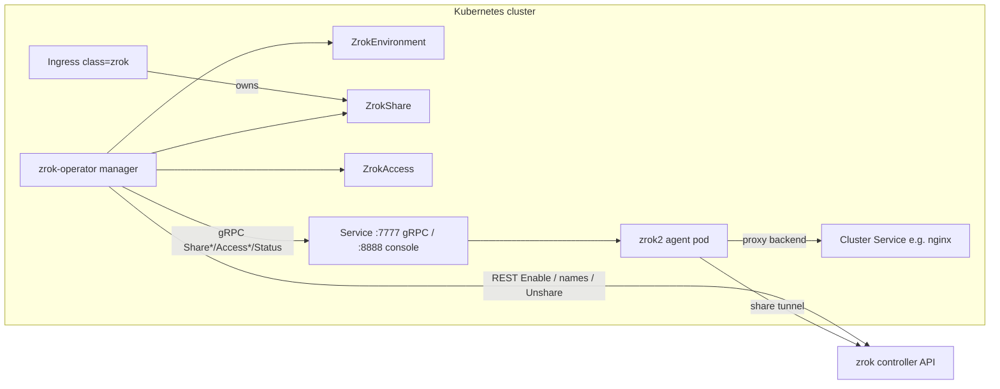
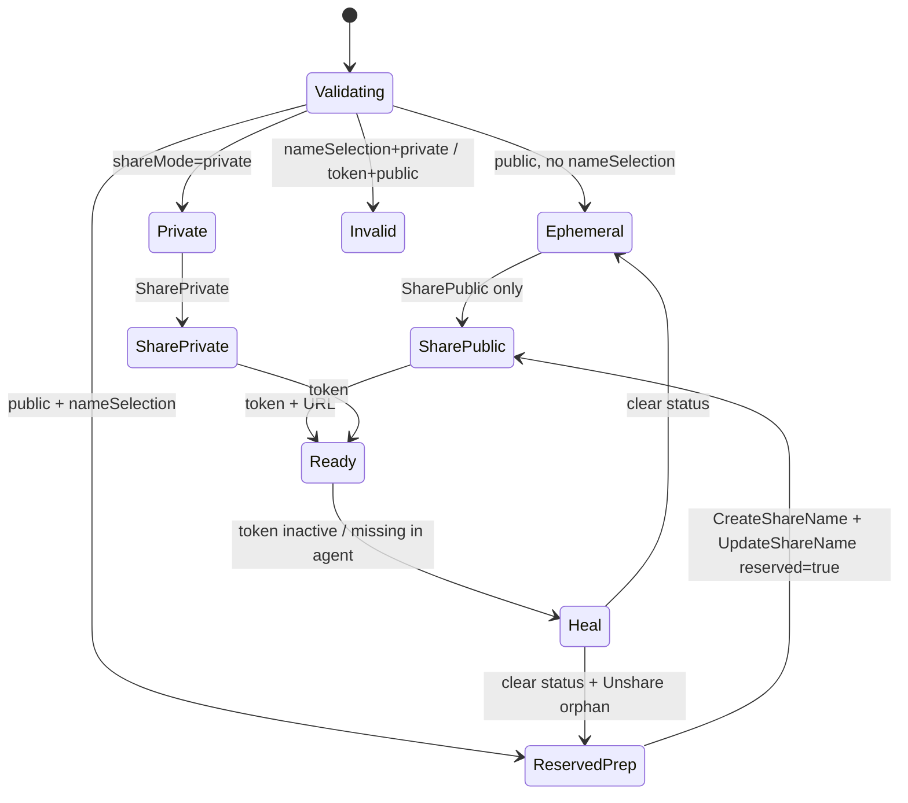

# Architecture Diagrams

> **Last Updated:** 2026-08-12
>
> Visual companion to [system-architecture.md](system-architecture.md).

## Control + data plane

```mermaid
flowchart LR
  subgraph cluster [Kubernetes cluster]
    mgr[zrok-operator manager]
    crEnv[ZrokEnvironment]
    crShare[ZrokShare]
    crAccess[ZrokAccess]
    crIng[Ingress class=zrok]
    agent[zrok2 agent pod]
    svc[Service :7777 gRPC / :8888 console]
    upstream[Cluster Service e.g. nginx]
  end
  zrokAPI[zrok controller API]

  crIng -->|owns| crShare
  mgr --> crEnv
  mgr --> crShare
  mgr --> crAccess
  mgr -->|REST Enable / names / Unshare| zrokAPI
  mgr -->|gRPC Share*/Access*/Status| svc
  svc --> agent
  agent -->|proxy backend| upstream
  agent -->|share tunnel| zrokAPI
```

## Share reservation modes

```mermaid
stateDiagram-v2
  [*] --> Validating
  Validating --> Ephemeral: public, no nameSelection
  Validating --> ReservedPrep: public + nameSelection
  Validating --> Private: shareMode=private
  Validating --> Invalid: nameSelection+private / token+public
  ReservedPrep --> SharePublic: CreateShareName + UpdateShareName reserved=true
  Ephemeral --> SharePublic: SharePublic only
  Private --> SharePrivate: SharePrivate
  SharePublic --> Ready: token + URL
  SharePrivate --> Ready: token
  Ready --> Heal: token inactive / missing in agent
  Heal --> ReservedPrep: clear status + Unshare orphan
  Heal --> Ephemeral: clear status
```
