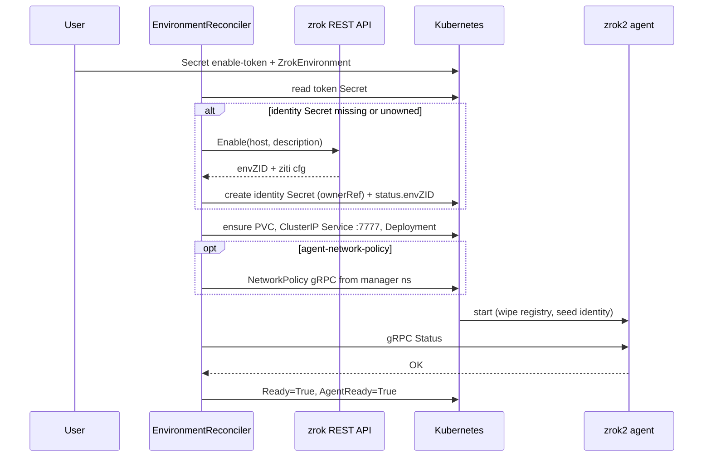

# Area: Environment Lifecycle

> **Last Updated:** 2026-08-18

## Overview

Turns a `ZrokEnvironment` + enable-token Secret into a Ready zrok environment: REST Enable, identity Secret, PVC, Service, agent Deployment. Delete Disable (unless Retain) and tear down owned objects. Blocks delete while Shares still reference the Env.

## Architecture Diagram

## How It Works

1. **Finalizer** `zrok.k8s.zrok.io/environment` on create path
2. **ensureEnabled** — if identity Secret absent **or unowned**: REST `Enable` with `host` and `description` both `{uniqueID}/zrok-operator/{ns}/{name}`. Unowned `{env}-zrok-identity` is deleted first (planted-identity defense). Owned Secret with `envZID` is crash-recovery (copy into status). Persist Secret keys `envZID`, `environment.json`, `identity`, `metadata.json`, `config.json`. Race on Create → Disable orphan envZID
3. **Ensure children** — PVC `{env}-zrok-home`, ClusterIP Service `{env}-agent` (gRPC only; hijacked Type/ExternalName deleted), Deployment `{env}-agent`; optional NetworkPolicy when `--agent-network-policy`; `SetControllerReference`
4. **Allowlists** — `spec.agent.image` / `spec.apiEndpoint` fail Ready with `ImageNotAllowed` / `EndpointNotAllowed` (2m requeue, no storm)
5. **Ready** — Deploy ReadyReplicas≥1 **and** Agent `Status` succeeds
6. **Delete** — if any Share lists this Env → requeue / event `SharesExist`; else REST `Disable` unless `reclaimPolicy=Retain`; delete Deploy/Service/NP/Secret/(PVC if Delete)

## Component Interactions

| Step | Component |
|---|---|
| Enable/Disable | `zrokclient.RESTClient` |
| Workload shape | `internal/agent` |
| Ready probe | `zrokclient.AgentClient.Status` |
| Ownership | Env reconciler Owns Deploy/Service/PVC/Secret |

## Business Rules

1. Replicas ≤ 1; strategy Recreate
2. Identity Secret is trusted only with controller ownerRef; missing Secret with EnvZID forces re-enable
3. Cannot delete Env while Shares exist
4. Default API endpoint `https://api-v2.zrok.io` when `spec.apiEndpoint` empty; must be https + allowlisted
5. Enable host/description `{uniqueID}/zrok-operator/{ns}/{name}`; `uniqueID` defaults to kube-system Namespace UUID
6. Agent start **wipes** `agent-registry.json` (operator owns shares)
7. Agent Service is ClusterIP gRPC-only; console binds 127.0.0.1

## Edge Cases & Failure Modes

| Scenario | Behavior |
|---|---|
| Enable succeeds, Secret Create fails | Disable orphan envZID |
| Agent not Ready | Ready=False `WaitingForAgent`; requeue 10s (Deployment NotFound after Create is this path, not a reconcile error) |
| Shares still present on Env delete | Block; event `SharesExist` |
| `reclaimPolicy=Retain` | Skip Disable; leave remote env |
| kube-system GET fails and `spec.uniqueID` empty | EnableError; set `spec.uniqueID` or fix RBAC |
| PVC already has stale identity | Seed init repairs `identities/environment.json` |
| Unowned identity Secret | Deleted; Enable retried |
| PVC/Service/Deployment Create AlreadyExists | Ignore (two reconciles racing Get-miss) |
| Agent Service ExternalName/NodePort | Deleted; next reconcile creates ClusterIP |

## Known Issues & Tech Debt

- README still describes HTTP agent console for manager control (wrong; gRPC). Console is localhost-only now.

## Related Docs

- [components/environment-controller.md](../components/environment-controller.md)
- [components/agent-resources.md](../components/agent-resources.md)
- [adr/AGENT_REGISTRY_WIPE.md](../../adr/AGENT_REGISTRY_WIPE.md)
