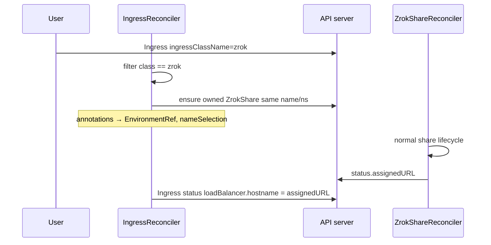

# Area: Ingress Translation

> **Last Updated:** 2026-08-12

## Overview

Maps Kubernetes Ingress objects with `ingressClassName: zrok` into owned `ZrokShare` CRs and mirrors `status.assignedURL` onto the Ingress load-balancer hostname. Convenience UX over writing ZrokShare YAML.

## Architecture Diagram

## How It Works

1. Watch Ingress; process only `ingressClassName == "zrok"`
2. Build desired `ZrokShare` (same name as Ingress) from rules/backends + annotations
3. `SetControllerReference` — Owns ZrokShare
4. When Share has `AssignedURL`, copy to Ingress status LB hostname

### Annotations

| Annotation | Purpose | Default |
|---|---|---|
| `zrok.k8s.zrok.io/environment` | ZrokEnvironment name | `default` |
| `zrok.k8s.zrok.io/name` | Reserved frontend name | (derive / empty) |
| `zrok.k8s.zrok.io/namespace-token` | Namespace token | `public` |

Sample: `config/samples/ingress_zrok.yaml`.

## Business Rules

1. Only class `zrok` is managed
2. Share name = Ingress name (same namespace)
3. Share lifecycle rules still apply (prefer reserved names)

## Edge Cases & Failure Modes

| Scenario | Behavior |
|---|---|
| Missing/invalid annotation combo | Event `InvalidIngress`; Share may not Ready |
| Env not Ready | Share waits; Ingress hostname empty |
| Ingress deleted | Owned Share deleted (GC) |

## Related Docs

- [areas/share-lifecycle.md](share-lifecycle.md)
- Source: `internal/controller/ingress_controller.go`
