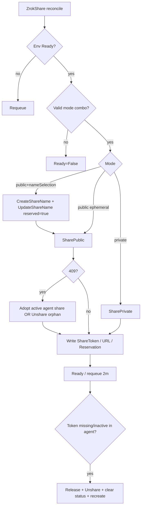

# Area: Share Lifecycle

> **Last Updated:** 2026-08-12

## Overview

Reconciles `ZrokShare` against a Ready Environment’s agent and the remote controller: reserve/promote frontend names, create public/private shares, adopt or heal on 409/drift, and delete via agent Release + REST Unshare + optional DeleteShareName.

## Architecture Diagram

## How It Works

### Modes → `status.reservation`

| Spec | Reservation | Path |
|---|---|---|
| `shareMode=public`, no `nameSelection` | `ephemeral` | SharePublic only; dies on agent restart |
| `shareMode=public` + `nameSelection` | `reserved` | CreateShareName → UpdateShareName(reserved=true) → SharePublic with NameSelections |
| `shareMode=private` | `private` | SharePrivate; optional `privateShareToken` |

Invalid: `nameSelection` with private; `privateShareToken` with public.

### Create / adopt

- Prefer reserved name convention `ko-<k8s-ns>-<share-name>` (`agent.ManagedFrontendName`)
- If status token empty + reserved name: look up **active** agent Status share by frontend name
- SharePublic 409: adopt active agent share; else `FindShareByFrontendName` + `Unshare` remote holder + requeue ~2s

### Heal

If status token missing or inactive in agent: ReleaseShare (best effort) → REST Unshare → clear status fields → recreate. Persist status clear (not in-memory only).

### Delete (finalizer `zrok.k8s.zrok.io/share`)

1. Resolve token: status → agent → List/Find by frontend name → parse from DeleteShareName 409 (`share '…'` regex)
2. Agent `ReleaseShare`
3. REST `Unshare`
4. If reclaim Delete + reserved name: `DeleteShareName`; on 409 still attached → Unshare parsed token → requeue ~3s
5. Remove finalizer

Does **not** Own K8s children. Watches Environments → map to Shares (`mapEnvToShares`).

## Business Rules

1. CreateShareName **409/already = success**; always promote with UpdateShareName(reserved=true)
2. Only adopt **active** agent shares
3. Operator owns lifecycle; agent registry wiped on restart
4. Requeue Ready every 2m for drift
5. No share metadata API — identification via reserved name + env description + upstream URL

## Edge Cases & Failure Modes

| Scenario | Behavior |
|---|---|
| Remote name held, agent empty | Unshare orphan → recreate |
| Status token set, agent restarted | Heal clears + recreates (reserved keeps name) |
| Delete without ShareToken | Discover token before Release |
| DeleteShareName 409 attached | Parse token, Unshare, retry |
| Ephemeral after agent restart | Share gone; reconcile creates new random name |

## Known Issues & Tech Debt

- UI Share panel may show “Reservation: ephemeral” even when Names list has reserved=true — trust Names / API overview
- Metrics `zrok_share_ready` not updated

## Related Docs

- [components/share-controller.md](../components/share-controller.md)
- [components/zrokclient.md](../components/zrokclient.md)
- [adr/RESERVED_FRONTEND_NAMES.md](../../adr/RESERVED_FRONTEND_NAMES.md)
- [adr/AGENT_REGISTRY_WIPE.md](../../adr/AGENT_REGISTRY_WIPE.md)
