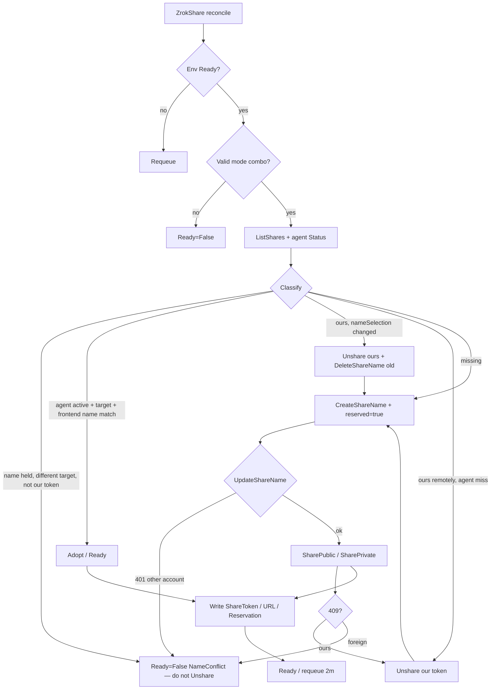

# Area: Share Lifecycle

> **Last Updated:** 2026-08-18 (nameSelection rename)

## Overview

Reconciles `ZrokShare` against a Ready Environment’s agent and the remote controller: reserve/promote frontend names, create public/private shares, adopt or heal **only when the remote/agent target matches `spec.upstream`**, and delete via agent Release + REST Unshare + optional DeleteShareName.

zrok shares have **no description/labels API**. Identity is reserved name + env description + upstream URL. Kubernetes labels are stamped on the CR (`agent.ShareLabels`).

## Architecture Diagram

## How It Works

### Modes → `status.reservation`

| Spec | Reservation | Path |
|---|---|---|
| `shareMode=public`, no `nameSelection` | `ephemeral` | SharePublic only; dies on agent restart |
| `shareMode=public` + `nameSelection` | `reserved` | CreateShareName → UpdateShareName(reserved=true) → SharePublic with NameSelections |
| `shareMode=private` | `private` | SharePrivate; optional `privateShareToken` |

Invalid: `nameSelection` with private; `privateShareToken` with public.

### Inventory (every reconcile)

`REST.ListShares(envZID)` + `Agent.Status`. Match by status token, then reserved frontend name, then private token. Compare `ShareSummary.Target` / agent `BackendEndpoint` to `spec.upstream` (`zrokclient.TargetsEqual` — trim slash, default :80/:443).

### Create / adopt

- Prefer reserved name convention `ko-<k8s-ns>-<share-name>` (`agent.ManagedFrontendName`)
- Adopt **active** agent share only if frontend name matches `spec.nameSelection.name` **and** backend target matches **and** shareMode/backendMode/closed match. Annotation `zrok.k8s.zrok.io/applied-digest` covers oauth/basicAuth/insecure/accessGrants (empty digest = upgrade; stamp, don't rebuild)
- Name held remotely, **same target**, agent empty → Unshare **our** token (reserved name stays) → SharePublic (registry-wipe heal)
- Name held remotely, **different target**, CR does not own that token → `NameConflict`, **never Unshare**
- Another `ZrokShare` already claims the same `nameSelection` (any namespace) → `NameConflict`, **never Unshare**
- CreateShareName 409 then UpdateShareName **401** → `NameConflict` (another zrok account owns the name; public frontend names are globally unique)
- SharePublic 409: re-inventory; same rules (adopt ours / rebind ours / NameConflict)
- Agent `BackendEndpoint` empty or inactive → do not adopt; Release + recreate
- `ListShares` error: if the agent still has our active matching share, stay Ready; otherwise `InventoryError`

### Heal

Spec.upstream change on **our** status token (target drifted) → Release + Unshare our token → recreate. Persist status clear.

`spec.nameSelection.name` change (the DNS label before `.shares.zrok.io`, not the FQDN): do **not** adopt the old token even if target still matches. Sequence:

1. `CreateShareName` + `UpdateShareName(reserved=true)` on the **new** name first (401 → NameConflict, old share stays)
2. Release + Unshare **our** token
3. `DeleteShareName` the **old** label unless `reclaimPolicy=Retain` (409 still-attached → requeue 3s; annot `zrok.k8s.zrok.io/reclaim-name`)
4. SharePublic with new `NameSelections`
5. Event `ShareRenamed`; `status.assignedURL` becomes `https://<new>.shares.zrok.io`

Same rebuild for shareMode / backendMode / closed / privateShareToken drift (visible on agent `ShareDetail`) and for oauth / basicAuth / insecure / accessGrants via applied-digest. `reclaimPolicy` is not in the digest.

### Delete (finalizer `zrok.k8s.zrok.io/share`)

1. Resolve token: status → agent name+target → ListShares name+target
2. Unshare **only** if `isOurShareToken` (status token, or remote/agent target match)
3. If reclaim Delete + reserved name: `DeleteShareName`; 409 still attached → Unshare only if ours, else leave name (`NameRetained`); **401** → `NameRetained`, drop finalizer (do not retry as error). Missing/empty enable-token Secret → skip REST, still drop finalizer.
4. Remove finalizer

Does **not** Own K8s children. Watches Environments → map to Shares (`mapEnvToShares`). Stamps `agent.ShareLabels` on the CR.

## Business Rules

1. CreateShareName **409/already = success**; always promote with UpdateShareName(reserved=true) — skipped on NameConflict. UpdateShareName **401** → NameConflict (name owned by another zrok account; public frontend names are globally unique)
2. Only adopt **active** agent shares whose backend matches `spec.upstream` and whose frontend name matches `spec.nameSelection.name`
3. Never Unshare a reserved-name holder with a different target unless the CR already owns that token
4. Operator owns lifecycle; agent registry wiped on restart
5. Requeue Ready every 2m for drift; NameConflict requeues 2m
6. No share metadata API — identification via reserved name + env description/host `{uniqueID}/zrok-operator/{ns}/{env}` + upstream URL
7. `--restrict-upstream` (Helm `security.restrictUpstream`, default false): `spec.upstream` must be a Service in the Share namespace; `socks` → `BackendModeNotAllowed`

## Edge Cases & Failure Modes

| Scenario | Behavior |
|---|---|
| Remote name held, different target | NameConflict; leave remote share |
| UpdateShareName 401 | NameConflict (another account owns the name); requeue 2m, **nil** reconcile error |
| Two CRs same reserved name | NameConflict on the second; delete of one does not DeleteShareName |
| Remote name held, same target, agent empty | Unshare ours + recreate (only if no other CR claims the name) |
| Status token set, agent restarted | Heal Unshare our token + recreate (reserved keeps name) |
| ListShares down, agent still serving | Stay Ready from agent Status |
| Delete without ShareToken | Discover token by name+target only if no other CR claims the name |
| DeleteShareName 409 attached to foreign share | Leave name; event NameRetained |
| Ephemeral after agent restart | Share gone; reconcile creates new random name |
| `nameSelection.name` edited | Rebuild ours; delete old reserved name unless Retain |
| New name UpdateShareName 401 | NameConflict; old live share untouched |
| oauth / basicAuth secret rotation | Digest mismatch → same rebuild (no name delete) |

## Known Issues & Tech Debt

- UI Share panel may show “Reservation: ephemeral” even when Names list has reserved=true — trust Names / API overview
- Access gRPC has no description field; REST Access does — not used (bind address requires agent)

## Related Docs

- [components/share-controller.md](../components/share-controller.md)
- [components/zrokclient.md](../components/zrokclient.md)
- [adr/RESERVED_FRONTEND_NAMES.md](../../adr/RESERVED_FRONTEND_NAMES.md)
- [adr/AGENT_REGISTRY_WIPE.md](../../adr/AGENT_REGISTRY_WIPE.md)
