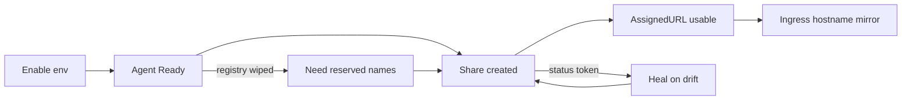

# System Effects & Data Strategy

> **Last Updated:** 2026-08-12

## Data Flywheel

Agent restarts force re-create of shares → reserved names + operator heal close the loop. Without reserved names, URLs churn every pod restart.

## Side Effects Map

| Component | Primary Job | Side Effect | Beneficiaries | Criticality |
|---|---|---|---|---|
| Env reconciler | Enable + agent | Identity Secret + PVC | Shares/Access | Critical |
| Agent start | Run zrok2 | Wipes registry | Prevents 409 vs operator | Critical |
| Share reconciler | SharePublic | Remote name reservation + live share | Users / Ingress | Critical |
| Share heal | Repair drift | REST Unshare orphans | Clears 409 loops | High |
| Ingress reconciler | Translate Ingress | Creates ZrokShare | Ingress users | Medium |
| Env delete | Disable | Destroys remote env | Cleanup | High (blocked by Shares) |

## Data Accumulation Inventory

| Data | Produced By | Storage | Consumers | Staleness |
|---|---|---|---|---|
| envZID / identity | REST Enable | K8s Secret + PVC copy | Agent, Disable | Durable until Disable |
| ShareToken | Agent Share* | CR status | Heal, Delete | Must match live agent |
| Frontend name | CreateShareName | Remote controller | SharePublic, DeleteShareName | Durable if reserved |
| agent-registry.json | Agent (historical) | PVC — **wiped on start** | None (intentionally) | Always empty at start |
| AssignedURL | Share response | CR + Ingress status | Users | Updates on recreate |

## Knock-On Failure Matrix

| Component Down | Immediate Impact | Gradual Degradation | Mitigation |
|---|---|---|---|
| zrok controller API | Enable/name/Unshare fail | New Shares stuck; deletes may leave orphans | Requeue; manual Unshare in UI |
| Agent pod CrashLoop | Env not Ready; Shares wait | Existing remote reserved shares orphan | Heal Unshare + recreate when agent returns |
| Manager down | No reconcile | Drift accumulates | Leader election / restart |
| Identity Secret deleted | Re-Enable path | New envZID; old remote env orphan if Disable not run | Avoid manual Secret deletes |
| PVC lost | Agent loses local state | Registry already wiped; identity re-seeded from Secret | Secret is source of truth |

## Component Reusability Map

| Component | Reusable For | API Surface |
|---|---|---|
| `zrokclient.RESTClient` | Any controller needing controller API | Enable/Disable/Names/Unshare/Find |
| `zrokclient.AgentClient` | Share/Access/Env Ready | Status/Share*/Release*/Access* |
| `internal/agent` naming | Samples, Ingress defaults | `ManagedFrontendName`, `AgentDialAddr` |
