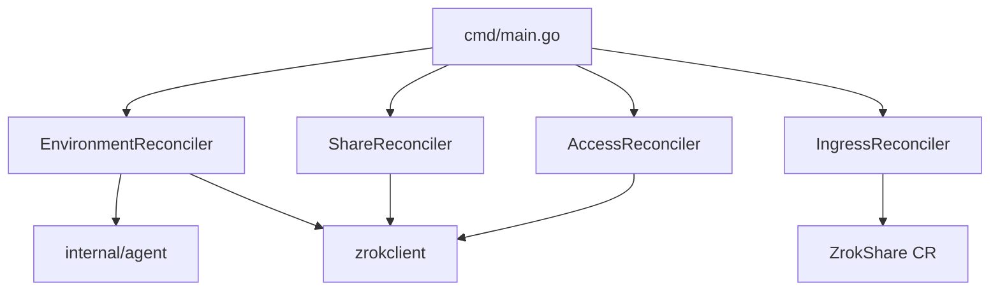

# Component Directory

> **Last Updated:** 2026-08-12

One-line catalog. Deep dives live under `components/`.

| Component | Location | Purpose | Doc |
|---|---|---|---|
| Manager entry | `cmd/main.go` | Wires reconcilers + recorders | — |
| API types | `api/v1alpha1/` | CRDs, conditions, finalizers | [system-architecture.md](system-architecture.md) |
| Environment reconciler | `internal/controller/environment_controller.go` | Enable, agent workload, Disable | [components/environment-controller.md](components/environment-controller.md) |
| Share reconciler | `internal/controller/share_controller.go` | Public/private share lifecycle | [components/share-controller.md](components/share-controller.md) |
| Access reconciler | `internal/controller/access_controller.go` | Private share consumer | [components/access-controller.md](components/access-controller.md) |
| Ingress reconciler | `internal/controller/ingress_controller.go` | Ingress → owned ZrokShare | [areas/ingress-translation.md](areas/ingress-translation.md) |
| Agent resources | `internal/agent/` | Desired Deploy/PVC/Service/naming | [components/agent-resources.md](components/agent-resources.md) |
| zrokclient | `internal/zrokclient/` | REST + Agent gRPC | [components/zrokclient.md](components/zrokclient.md) |
| Status helpers | `internal/status/` | SetCondition / IsTrue | — |
| Metrics | `internal/metrics/` | Prometheus instruments | — |
| Gateway (stub) | `internal/gateway/` | Future Gateway API | — |
| Helm chart | `charts/zrok-operator/` | Install | [build-deployment.md](build-deployment.md) |

