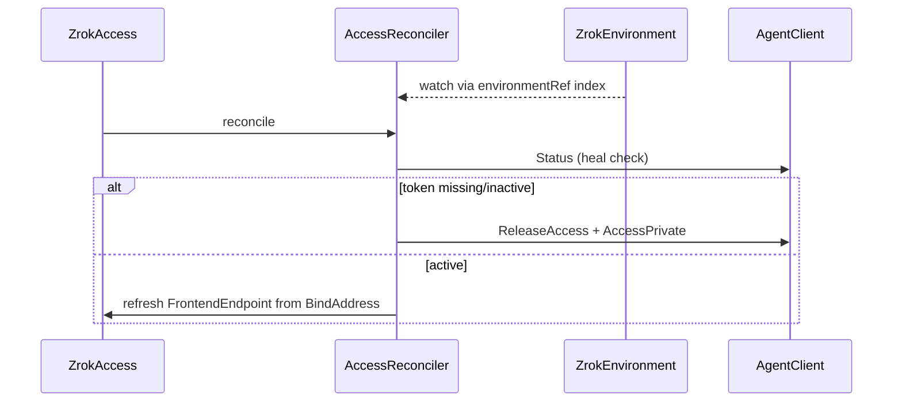

# Component: Access Controller

- **Location**: `internal/controller/access_controller.go`
- **Purpose**: Private-share consumer via agent `AccessPrivate` / `ReleaseAccess`
- **Owner**: manager (`zrokaccess-controller` recorder)
- **Last analysed**: 2026-08-12

## Data Flow Diagram

## Business Rules

| Rule | Implementation |
|------|----------------|
| Env must be Ready | Same gate as Share; Watches Env via field index |
| Create / heal | Store AccessToken; verify via Agent Status; recreate if gone, **or** if `spec.shareToken` / non-ephemeral `bindAddress` drifted |
| FrontendEndpoint | Prefer AccessDetail.BindAddress; fall back to frontend token |
| Finalizer cleanup | `zrok.k8s.zrok.io/access` → ReleaseAccess |

### Spec defaults

- `bindAddress` default `0.0.0.0:0`
- Requires `environmentRef` + `shareToken`

## Critical Edge Cases

| Edge Case | Notes |
|-----------|-------|
| Agent registry wipe | Status miss → heal: clear token + AccessPrivate again |
| `shareToken` / explicit bind change | ReleaseAccess + AccessPrivate with new spec (`:0` bind is not compared to the assigned port) |
| Env not Ready | Requeue 10s; Env watch enqueues Access when Env Ready |
| Status unreachable | Keep token; requeue 2m and retry |

## Dependencies

`AgentClient.AccessPrivate` / `ReleaseAccess` / `Status`; Env Ready + dial addr; field index `.spec.environmentRef.name`.

## Observability

Events: `AccessError`, `Ready` (transition-only). Counter: `zrok_access_reconcile_errors`.

## References

- Sample: `config/samples/zrok_v1alpha1_access.yaml`
- [areas/share-lifecycle.md](../areas/share-lifecycle.md) (private mode)
