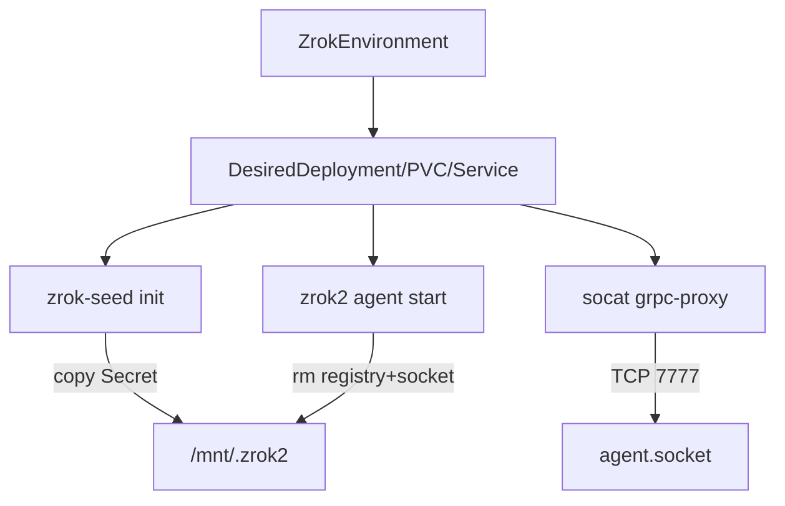

# Component: Agent Resources

- **Location**: `internal/agent/` (`resources.go`, `resources_test.go`)
- **Purpose**: Pure helpers for desired PVC/Service/Deployment + naming; no reconcile loop
- **Owner**: Environment reconciler (consumes Desired*)
- **Last analysed**: 2026-08-13

## Data Flow Diagram

## Business Intent & Domain Logic

### Purpose

Keep agent pod shape consistent: non-root, seed identity once/repair, **wipe registry every start** so operator (not agent ReloadRegistry) owns shares.

### Business Rules

| Rule | Implementation | Impact if Violated |
|------|----------------|--------------------|
| Wipe registry on start | shell before `zrok2 agent start` | Agent ReloadRegistry SharePublic → 409 vs remote |
| Seed `identities/environment.json` | init container | Agent enable/share fails |
| Replicas max 1 | DesiredDeployment | Dual agents |
| No root chown init | runAsNonRoot / UID 2171 | Security policy reject |

### Naming

| Helper | Pattern |
|---|---|
| `PVCName` | `{env}-zrok-home` |
| `DeploymentName` / `ServiceName` | `{env}-agent` |
| `IdentitySecretName` | `{env}-zrok-identity` |
| `ManagedFrontendName` | `ko-{share.Namespace}-{share.Name}` |
| `EnvironmentDescription` / `EnvironmentHost` | `{uniqueID}/zrok-operator/{ns}/{name}` (Enable body; shares have no metadata API) |
| `ShareLabels` | K8s labels on ZrokShare (`managed-by`, env, share-mode, frontend-name) |
| `AgentDialAddr` | `{svc}.{ns}.svc:7777` |

### Constants

- `DefaultImage = docker.io/openziti/zrok2:2.0.4`
- `DefaultSocatImage = docker.io/alpine/socat:1.8.1.3`
- `ZrokUID = 2171`, `DefaultGRPCPort = 7777`, `AppName = zrok-agent`

### Pod shape

1. **Init `zrok-seed`**: copy Secret into `/mnt/.zrok2` including `environment.json` + `identities/environment.json`
2. **Main**: `rm -f` `agent.socket` + `agent-registry.json`; `zrok2 agent start --console-address 0.0.0.0…`
3. **Sidecar `grpc-proxy`**: socat TCP-LISTEN:7777 → unix `/mnt/.zrok2/agent.socket`
4. **Probes**: HTTP `/v1/agent/version` on console port
5. **Strategy**: Recreate

Labels: `app.kubernetes.io/*`, `zrok.k8s.zrok.io/environment`.

## Invariants

- Registry file must not be relied on across restarts
- Manager dials **gRPC** via Service :7777, not console HTTP for control RPCs

## Testing

`resources_test.go` — naming, seed init present, command contains registry wipe + `zrok2 agent start`.

## Common Issues

| Symptom | Cause | Fix |
|---|---|---|
| loaded N public shares → 409 | Old image without wipe | Redeploy DesiredDeployment |
| missing identities/environment.json | Seed bug / old PVC | Seed repair path |

## References

- [adr/AGENT_REGISTRY_WIPE.md](../../adr/AGENT_REGISTRY_WIPE.md)
- [areas/environment-lifecycle.md](../areas/environment-lifecycle.md)
