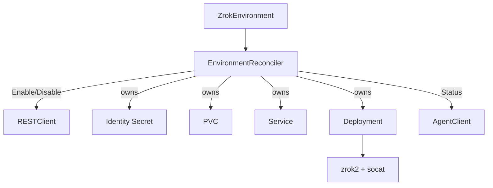

# Component: Environment Controller

- **Location**: `internal/controller/environment_controller.go`
- **Purpose**: Enable zrok env, materialize identity + agent workload, Disable on delete
- **Owner**: manager (`zrokenvironment-controller` recorder)
- **Last analysed**: 2026-08-12

## Data Flow Diagram

## Business Intent & Domain Logic

### Purpose

One CR ≈ one zrok environment + one agent data plane for Shares/Accesses in that namespace (or referenced Env).

### Business Rules Enforced

| Rule | Implementation | Impact if Violated |
|------|----------------|--------------------|
| Enable before agent | ensureEnabled before DesiredDeployment | Agent starts without identity |
| Block delete if Shares exist | list Shares by EnvironmentRef | Orphan Shares / broken delete |
| Replicas ≤ 1 | clamp in DesiredDeployment | Split-brain agents |
| Retain skips Disable | reclaimPolicy check | Remote env left on purpose |

### Critical Edge Cases

| Edge Case | Handling |
|-----------|----------|
| Enable OK, Secret create fail | Disable orphan envZID |
| Secret missing, status has EnvZID | Re-enable (Secret is SoT) |
| Deploy Ready but Agent Status fail | Not Ready |

### Invariants

- Finalizer `zrok.k8s.zrok.io/environment`
- ControllerReference on Deploy/Service/PVC/Secret
- Description `zrok-operator/{ns}/{name}`

## Dependencies

| Dependency | Details |
|------------|---------|
| `RESTClient.Enable/Disable` | Controller API |
| `AgentClient.Status` | Ready gate |
| `internal/agent` Desired* | Resource shapes |
| Enable token Secret | `spec.enableTokenSecretRef` (key default `enable-token`) |

## Dependents

Share + Access reconcilers require Env Ready. Ingress defaults EnvironmentRef to `default`.

## Configuration

- `spec.apiEndpoint` (default empty → `https://api-v2.zrok.io`)
- `spec.agent.image` (default `docker.io/openziti/zrok2:2.0.4`)
- `spec.agent.consolePort` default 8888
- Persistence size default 1Gi RWO

## Error Handling

Events: `SecretError`, `EnableError`, `Ready`, `SharesExist`, `DisableError`, `Disabled`, `Enabled`.

## Testing

Controller envtest + unit coverage in `internal/controller/` (env-focused tests as present).

## Common Issues

| Symptom | Fix |
|---|---|
| Env never Ready | Check identity Secret, agent logs, gRPC Status via :7777 |
| Delete stuck SharesExist | Delete Shares first |
| Seed missing environment.json | Ensure seed init path deployed |

## References

- [areas/environment-lifecycle.md](../areas/environment-lifecycle.md)
- [components/agent-resources.md](agent-resources.md)
