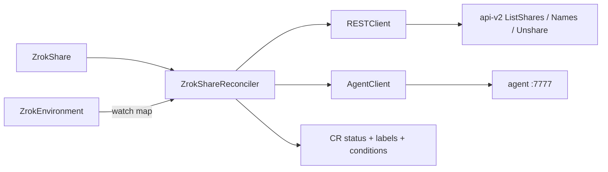

# Component: Share Controller

- **Location**: `internal/controller/share_controller.go`, `share_inventory.go`, `share_apply.go`
- **Purpose**: Reconcile `ZrokShare` create/adopt/heal/delete against agent gRPC + controller REST
- **Owner**: manager (`zrokshare-controller` recorder)
- **Last analysed**: 2026-08-18

## Data Flow Diagram

## Business Intent & Domain Logic

### Purpose (The WHY)

Kubernetes-native share lifecycle so users don’t run `zrok2 share` by hand, and so reserved names survive agent restarts (registry wipe) **without stealing someone else's share**.

### Business Rules Enforced

| Rule | Implementation | Impact if Violated |
|------|----------------|--------------------|
| nameSelection ⇒ public | Spec validation early in reconcile | Invalid Ready=False |
| privateShareToken ⇒ private | Spec validation + CEL | Invalid Ready=False |
| CreateShareName then reserved=true | REST calls after inventory, skipped on NameConflict | Name stays ephemeral remotely |
| Adopt only active agent shares with matching target **and** reserved name | `classifyShare` + `agentShareMatchesSpec` | Adopt wrong URL after nameSelection edit |
| Unshare only owned tokens | `TargetsEqual` vs `spec.upstream`, or status token | Steal foreign reserved name |
| Rename: reserve new name before tearing down old | `ensureReservedName` then `releaseAndClear` | 401 on new name would drop the working share |
| Persist status clear on heal | Status update before recreate | In-memory clear → stuck 409 |

### Critical Edge Cases

| Edge Case | How It's Handled | What Could Go Wrong |
|-----------|------------------|---------------------|
| Name held, different target | NameConflict; no Unshare | Old code Unshared blindly |
| UpdateShareName 401 | NameConflict; requeue 2m | Returning the 401 as reconcile error storms retries |
| Name held, same target, agent empty | Unshare our token + SharePublic | 409 loop if Unshare fails |
| `nameSelection.name` changed | Unshare ours + DeleteShareName old + SharePublic new | Old URL stuck in assignedURL |
| SharePublic 409 | Re-inventory; same ownership rules | |
| Token in status, not in agent | Heal if ours (target or status token) | |
| Delete without token | Discover via name+target only | |
| DeleteShareName 409 foreign | Leave name; NameRetained event | |
| DeleteShareName 401 | NameRetained; drop finalizer (name owned by another account or bad token) | Stuck CRD uninstall / e2e AfterAll |

### Invariants

- Finalizer `zrok.k8s.zrok.io/share` until remote+agent cleanup done (or reclaim Retain semantics for name delete)
- `status.reservation` ∈ {ephemeral, reserved, private}
- Does not Own Deployments — only Env does
- CR labels from `agent.ShareLabels`

### Assumptions & Limitations

- zrok Share API has no metadata/tags — cannot push description/labels to shares
- Env Enable still gets description+host `{uniqueID}/zrok-operator/{ns}/{name}`
- Ephemeral shares are intentionally non-sticky under registry wipe
- Ready requeue 2m assumes eventual consistency with agent Status

## Dependencies

| Dependency | Type | Details |
|------------|------|---------|
| `zrokclient.RESTClient` | interface | Names, Unshare, **ListShares** |
| `zrokclient.AgentClient` | interface | SharePublic/Private, ReleaseShare, Status |
| `internal/agent` | helpers | ShareLabels, ManagedFrontendName, dial addr |
| Env Ready | precondition | Share waits until AgentReady |

## Dependents

| Dependent | How |
|-----------|-----|
| Ingress reconciler | Creates ZrokShare with ShareLabels; reads AssignedURL |
| Users / samples | Direct ZrokShare CRs |

## Interface

Reconciler entry: `Reconcile(ctx, req) (Result, error)` via controller-runtime.

Key internals:

- `loadInventory` / `classifyShare` / `agentShareMatchesSpec` / `shareApplyDigest` (`share_inventory.go`, `share_apply.go`)
- `ensureReservedName`: `CreateShareName` + `UpdateShareName(..., true)`; UpdateShareName 401 → `setNameConflict`
- `releaseOurs` / `reclaimPreviousName` / `handleShareConflict` / `setNameConflict` (transition-only event)
- Delete: resolve owned token → Release → Unshare → DeleteShareName

Events: `ShareError`, `ReleaseError`, `Ready`, `ShareRenamed`, `NameConflict`, `NameRetained`. Ready reason `NameConflict` when the reserved name is foreign (other target, other ZrokShare, or other zrok account via UpdateShareName 401). `ShareRenamed` when `status.assignedURL` changes on an already-Ready share.

## Configuration

- Env `spec.apiEndpoint` + identity Secret account token
- Agent dial: `agent.AgentDialAddr(env)` → `{env}-agent.{ns}.svc:7777`
- Requeues: Ready 2m; NameConflict 2m; rebind ~2s; name attach ~3s

## Error Handling & Retries

- REST CreateShareName 409 → nil (idempotent)
- REST UpdateShareName 401 → NameConflict (not a reconcile error)
- REST DeleteShareName 401 → NameRetained; drop finalizer (do not storm)
- Unshare/DeleteShareName 404 → nil
- SharePublic 409 → inventory path, not blind Unshare
- Reconcile errors → event `ShareError`; metric `zrok_share_reconcile_errors`

## Concurrency & Safety

Single reconcile per object via controller-runtime workqueue; leader election on manager. No extra locks.

## Observability

Events: `ShareError`, `ReleaseError`, `Ready`, `ShareRenamed`, `NameConflict`, `NameRetained`. Logs around inventory/heal/delete.

## Testing Approach

- `share_inventory_test.go` / `share_apply_test.go` — classify/foreign/target/name drift (testing.T)
- `share_controller_test.go` — envtest + testify mocks (`ListShares`, Unshare, SharePublic, rename → DeleteShareName)
- `internal/zrokclient/share_test.go` — `TargetsEqual` / `FrontendNameFromEndpoint`

## Common Issues / Troubleshooting

| Symptom | Cause | Fix |
|---|---|---|
| Ready=False NameConflict | Reserved name attached to another target, another CR, or another zrok account (UpdateShareName 401) | Change nameSelection or free the name in the zrok UI |
| 409 name in use loop | Should be gone; check inventory Unshare of **ours** only | |
| Ready without ShareToken | Status not persisted / race | Check heal path; status update errors |
| URL didn't follow nameSelection | Pre-rename bug; should Unshare+recreate | Check ShareRenamed event / agent frontend vs spec name |
| Finalizer stuck | Token unknown + DeleteShareName 409 ours | Discover by target; Unshare; don’t strip finalizer unless last resort |
| Ephemeral after restart | No nameSelection | Add reserved name |

## References

- [areas/share-lifecycle.md](../areas/share-lifecycle.md)
- [components/zrokclient.md](zrokclient.md)
- [adr/RESERVED_FRONTEND_NAMES.md](../../adr/RESERVED_FRONTEND_NAMES.md)
