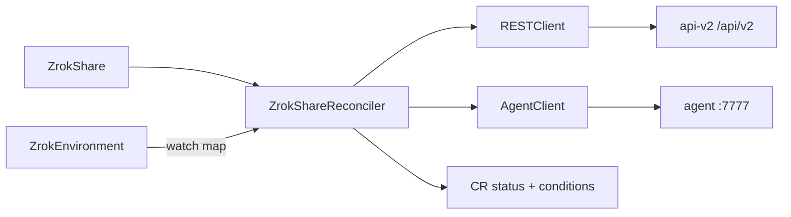

# Component: Share Controller

- **Location**: `internal/controller/share_controller.go`
- **Purpose**: Reconcile `ZrokShare` create/adopt/heal/delete against agent gRPC + controller REST
- **Owner**: manager (`zrokshare-controller` recorder)
- **Last analysed**: 2026-08-12

## Data Flow Diagram

## Business Intent & Domain Logic

### Purpose (The WHY)

Kubernetes-native share lifecycle so users don’t run `zrok2 share` by hand, and so reserved names survive agent restarts (registry wipe).

### Business Rules Enforced

| Rule | Implementation | Impact if Violated |
|------|----------------|--------------------|
| nameSelection ⇒ public | Spec validation early in reconcile | Invalid Ready=False |
| privateShareToken ⇒ private | Spec validation | Invalid Ready=False |
| CreateShareName then reserved=true | REST calls before SharePublic | Name stays ephemeral remotely |
| Adopt only active agent shares | Status inspection | Adopt dead share → endless fail |
| Persist status clear on heal | Status update before recreate | In-memory clear → stuck 409 |

### Critical Edge Cases

| Edge Case | How It's Handled | What Could Go Wrong |
|-----------|------------------|---------------------|
| SharePublic 409 | Adopt or Unshare orphan + requeue 2s | Wrong Unshare if Find mismatches |
| Token in status, not in agent | Heal: Release + Unshare + clear | Remote share leaked if Unshare fails |
| Delete without token | Discover via agent/REST/409 parse | Finalizer stuck if discovery fails |
| DeleteShareName still attached | Regex token from error, Unshare, requeue 3s | Parse miss → loop |

### Invariants

- Finalizer `zrok.k8s.zrok.io/share` until remote+agent cleanup done (or reclaim Retain semantics for name delete)
- `status.reservation` ∈ {ephemeral, reserved, private}
- Does not Own Deployments — only Env does

### Assumptions & Limitations

- zrok Share API has no metadata/tags
- Ephemeral shares are intentionally non-sticky under registry wipe
- Ready requeue 2m assumes eventual consistency with agent Status

## Dependencies

| Dependency | Type | Details |
|------------|------|---------|
| `zrokclient.RESTClient` | interface | Names, Unshare, FindShareByFrontendName |
| `zrokclient.AgentClient` | interface | SharePublic/Private, ReleaseShare, Status |
| `internal/agent` | helpers | ManagedFrontendName, dial addr from Env |
| Env Ready | precondition | Share waits until AgentReady |

## Dependents

| Dependent | How |
|-----------|-----|
| Ingress reconciler | Creates ZrokShare; reads AssignedURL |
| Users / samples | Direct ZrokShare CRs |

## Interface

Reconciler entry: `Reconcile(ctx, req) (Result, error)` via controller-runtime.

Key internal behaviors (names may vary slightly — search in file):

- Reserved name ensure: `CreateShareName` + `UpdateShareName(..., true)`
- Conflict handling on SharePublic
- Heal when token inactive
- Delete path: resolve token → Release → Unshare → DeleteShareName

Conditions used: `Ready`, `EnvironmentReady`, `ShareCreated`, `NameReady` (`api/v1alpha1/zz_conditions.go`).

## Configuration

- Env `spec.apiEndpoint` + identity Secret account token
- Agent dial: `agent.AgentDialAddr(env)` → `{env}-agent.{ns}.svc:7777`
- Requeues: Ready 2m; conflict ~2s; name attach ~3s

## Error Handling & Retries

- REST CreateShareName 409 → nil (idempotent)
- Unshare/DeleteShareName 404 → nil
- SharePublic 409 → adopt/heal path, not permanent fail
- Reconcile errors → event `ShareError`; metric `zrok_share_reconcile_errors`

## Concurrency & Safety

Single reconcile per object via controller-runtime workqueue; leader election on manager. No extra locks.

## Observability

Events: `ShareError`, `ReleaseError`, `Ready`. Logs around share create/heal/delete.

## Testing Approach

`internal/controller/share_controller_test.go` — testify mocks from `internal/zrokclient/mock` (mockery). Envtest suite in `suite_test.go`.

## Common Issues / Troubleshooting

| Symptom | Cause | Fix |
|---|---|---|
| 409 name in use loop | Orphan remote share / stale registry | Heal Unshare; ensure registry wipe deployed |
| Ready without ShareToken | Status not persisted / race | Check heal path; status update errors |
| Finalizer stuck | Token unknown + DeleteShareName 409 | Discover token; Unshare; don’t strip finalizer unless last resort |
| Ephemeral after restart | No nameSelection | Add reserved name |

## References

- [areas/share-lifecycle.md](../areas/share-lifecycle.md)
- [components/zrokclient.md](zrokclient.md)
- [adr/RESERVED_FRONTEND_NAMES.md](../../adr/RESERVED_FRONTEND_NAMES.md)
