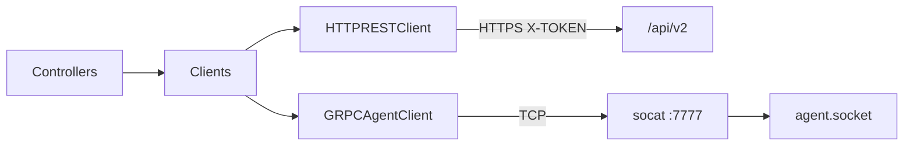

# Component: zrokclient

- **Location**: `internal/zrokclient/` (`client.go`, `agent_grpc.go`, `endpoint.go`, `mock/`)
- **Purpose**: Typed clients for zrok controller REST API and zrok2 agent gRPC
- **Owner**: Environment, Share, Access reconcilers
- **Last analysed**: 2026-08-18

## Data Flow Diagram



## Business Intent

Isolate transport details (media type, auth header, dial) behind small interfaces mockable with mockery.

## Interface (exported)

```go
type RESTClient interface {
  Enable(ctx, apiEndpoint, accountToken, host, description string) (envZID, zitiCfg string, err error)
  Disable(ctx, apiEndpoint, accountToken, envZID string) error
  CreateShareName(ctx, apiEndpoint, accountToken, namespaceToken, name string) error
  UpdateShareName(ctx, apiEndpoint, accountToken, namespaceToken, name string, reserved bool) error
  DeleteShareName(ctx, apiEndpoint, accountToken, namespaceToken, name string) error
  Unshare(ctx, apiEndpoint, accountToken, envZID, shareToken string) error
  ListShares(ctx, apiEndpoint, accountToken, envZID string) ([]RemoteShare, error)
}

type AgentClient interface {
  Status(ctx, addr string) (*agentGrpc.StatusResponse, error)
  SharePublic(ctx, addr string, req *agentGrpc.SharePublicRequest) (*agentGrpc.SharePublicResponse, error)
  SharePrivate(ctx, addr string, req *agentGrpc.SharePrivateRequest) (*agentGrpc.SharePrivateResponse, error)
  ReleaseShare(ctx, addr, token string) error
  AccessPrivate(ctx, addr string, req *agentGrpc.AccessPrivateRequest) (*agentGrpc.AccessPrivateResponse, error)
  ReleaseAccess(ctx, addr, token string) error
}
```

Helpers: `NewDefaultClients(httpClient, allowedAPIHosts)`, `NewSecureHTTPClient`, `ValidateAPIEndpoint`, `NormalizeAPIHosts`, `RemoteShare`, `TargetsEqual`, `FindByFrontendName` / `FindByToken`, `FrontendEndpointMatchesName`, `PersistEnabledEnvironment` (test helper). `api-v2.zrok.io` is always allowlisted. `EndpointNotAllowedError` / `IsEndpointNotAllowed`.

## Protocol details

| Client | Base | Auth | Notes |
|---|---|---|---|
| REST | `{apiEndpoint}/api/v2` | `X-TOKEN` | Media `application/zrok.v1+json`; default `https://api-v2.zrok.io`; **https + host allowlist**; `CheckRedirect` drops `X-TOKEN`, refuses cross-host / non-https |
| Agent | `host:port` | none (cluster network; optional NetworkPolicy) | Native gRPC `agentGrpc`; dial `AgentDialAddr` |

### Idempotent HTTP semantics

- `CreateShareName`: 409 / already → **nil**
- `DeleteShareName` / `Unshare`: 404 → **nil**
- `UpdateShareName` 401: caller maps to NameConflict (`zrokclient.IsUnauthorized`) — name owned by another account (CreateShareName 409 is swallowed first)

## Error Handling

Callers interpret SharePublic errors (409) at controller layer. REST methods wrap HTTP status in returned errors for non-special cases. `IsUnauthorized` matches `[401]` / `updateShareNameUnauthorized`.

## Testing

- `.mockery.yml` → `internal/zrokclient/mock/mocks.go`
- `endpoint_test.go` — allowlist, blocked hosts, CheckRedirect drops `X-TOKEN`
- **Never hand-write mocks** — `mise run gen`
- Controllers inject interfaces

## Common Issues

| Symptom | Cause |
|---|---|
| Dial fail :7777 | Agent/socat not Ready; wrong Service DNS |
| 401/403 REST | Wrong enable/account token in Secret, **or** UpdateShareName 401 because another account owns the reserved name |
| FindShare miss | Endpoint string format ≠ name matcher; use ListShares + Target

## References

- [areas/share-lifecycle.md](../areas/share-lifecycle.md)
- [testing-practices.md](../testing-practices.md)
