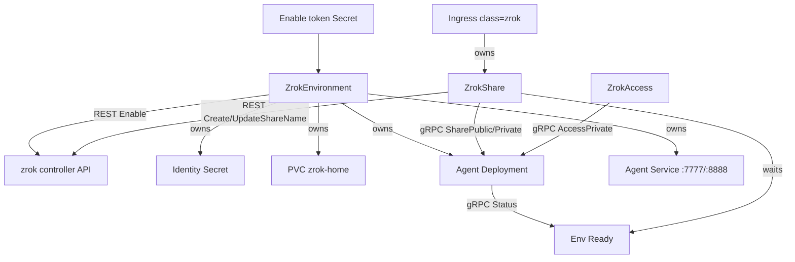

# zrok-operator System Architecture

> **Last Updated:** 2026-08-12

## 1. Overview

**zrok-operator** is a client-side Kubernetes operator that exposes in-cluster Services through [zrok/v2](https://github.com/openziti/zrok) public or private shares. It enables a zrok environment, runs a per-Environment `zrok2` agent (data plane), and reconciles `ZrokShare` / `ZrokAccess` CRs against that agent plus the remote zrok controller API.

It does **not** deploy the zrok controller or frontend (complement to `openziti/zrok2` server chart).

API group: `zrok.k8s.zrok.io/v1alpha1`. Module: `github.com/vulkoingim/zrok-operator`.

## 2. Component Map

| Layer | Component | Location | Purpose |
|---|---|---|---|
| API | CRD types | `api/v1alpha1/` | Environment, Share, Access specs/status |
| Control plane | Manager | `cmd/main.go` | controller-runtime manager, 4 reconcilers |
| Control plane | Environment reconciler | `internal/controller/environment_controller.go` | Enable, identity Secret, agent workload |
| Control plane | Share reconciler | `internal/controller/share_controller.go` | Share lifecycle vs agent + REST |
| Control plane | Access reconciler | `internal/controller/access_controller.go` | Private consumer |
| Control plane | Ingress reconciler | `internal/controller/ingress_controller.go` | Ingress class `zrok` → ZrokShare |
| Data plane helpers | Agent resources | `internal/agent/resources.go` | Desired Deploy/PVC/Service/naming |
| Clients | REST + gRPC | `internal/zrokclient/` | Controller API + Agent |
| Observability | Metrics | `internal/metrics/` | Prometheus (ready gauges mostly unwired) |
| Deploy | Helm / Kustomize | `charts/`, `config/` | Install path |

## 3. Primary Flows

### Happy path (public reserved)

1. User creates enable-token Secret + `ZrokEnvironment`
2. Reconciler REST `Enable` → writes identity Secret → PVC/Service/Deployment
3. Agent starts with **wiped** `agent-registry.json`; seed copies identity into `/mnt/.zrok2`
4. Env becomes Ready when Deploy ReadyReplicas≥1 **and** Agent `Status` OK
5. `ZrokShare` with `nameSelection` → CreateShareName → UpdateShareName(reserved=true) → SharePublic
6. Status gets `ShareToken`, `AssignedURL`, `Reservation=reserved`

Detail: [areas/environment-lifecycle.md](areas/environment-lifecycle.md), [areas/share-lifecycle.md](areas/share-lifecycle.md).

## 4. Data Stores

| Store | What | Owner |
|---|---|---|
| K8s etcd (CRs) | Desired + status for Env/Share/Access | Controllers |
| Identity Secret `{env}-zrok-identity` | envZID, environment.json, identity, metadata, config | Env reconciler |
| PVC `{env}-zrok-home` | `/mnt/.zrok2` agent home (identity copy; registry **wiped** each start) | Env reconciler / agent |
| Remote zrok controller | Environments, share names, live shares | REST client |
| Agent in-memory registry | Live shares/accesses while process runs | Agent (not persisted across restarts by design) |

**Consistency:** CR status is operator source of truth for tokens/URLs. Remote API can drift (orphans); heal/unshare paths repair that.

## 5. Background Processing

No workers/queues. Reconciliation + controller-runtime requeue:

- Share Ready requeues every **2m** (drift detection)
- Conflict heal requeues ~**2s**
- DeleteShareName “still attached” requeues ~**3s**

## 6. Security & Multi-Tenancy

- Enable token lives in user-provided Secret (`enable-token` key default)
- Identity Secret is cluster-scoped to the Environment’s namespace
- Agent runs non-root (`runAsNonRoot`, UID 2171)
- Isolation model: one Environment ≈ one zrok envZID ≈ one agent; Shares must reference an Environment in-cluster
- No multi-tenant SaaS layer in this repo — cluster RBAC is the boundary

## 7. Observability

- Structured logs via controller-runtime / zap
- Events via `events.EventRecorder` (reasons: `EnableError`, `ShareError`, `Ready`, …). **Ready events are transition-only** (False→True)
- Metrics:
  - `zrok_share_ready{namespace,name}` / `zrok_environment_ready{namespace,name}` gauges (1/0)
  - `zrok_share_reconcile_errors`, `zrok_environment_reconcile_errors`, `zrok_access_reconcile_errors` counters
- Agent probes: HTTP GET `/v1/agent/version` on console port
- Status writes use `status.PatchStatus` (MergeFrom + conflict retry)

## 8. Deployment Topology

| Piece | Where | Ports |
|---|---|---|
| Manager | `zrok-operator` Deployment (Helm/Kustomize) | metrics/health as configured |
| Agent | per-Environment Deployment `{env}-agent` | console **8888**, gRPC proxy **7777** |
| Remote API | `spec.apiEndpoint` or `https://api-v2.zrok.io` | HTTPS |

Leader election ID: `f22d3959.k8s.zrok.io`.

## 9. Known Systemic Issues / Constraints

1. **Registry wipe** → ephemeral shares cannot survive agent restart; reserved names required for sticky URLs ([ADR](../adr/AGENT_REGISTRY_WIPE.md))
2. **README stale:** claims manager uses HTTP `/v1/agent/*`; code uses **gRPC** via socat
3. **Orphan remote shares** after crashes/manual deletes cause 409 loops until heal/Unshare
4. Gateway API package is placeholder only (`internal/gateway/`)
5. CEL on ZrokShare rejects `nameSelection`+private / `privateShareToken`+public at admission (reconcile still validates for old CRDs)

## 10. References

- [components.md](components.md)
- [areas/system-effects.md](areas/system-effects.md)
- [architecture.md](architecture.md)
- [adr/](../adr/)
